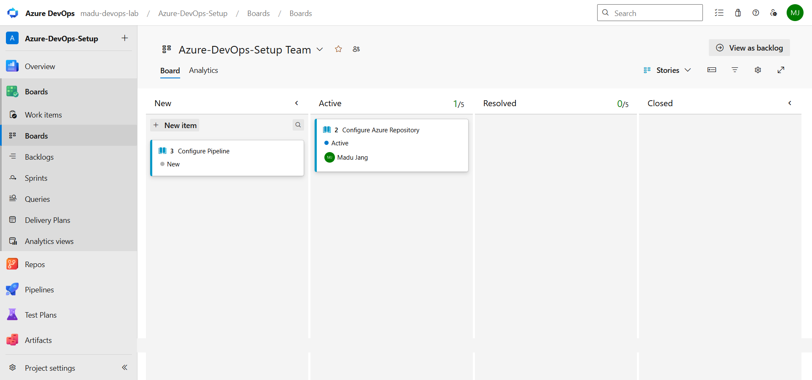
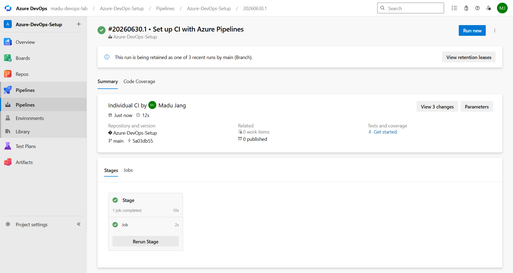
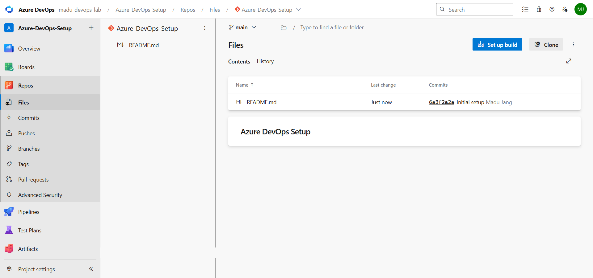

# Azure DevOps Setup

## Project Overview

This project demonstrates the foundational setup and configuration of Azure DevOps to support modern Software Development Lifecycle (SDLC) practices. The environment was configured to integrate collaboration, source control, agile planning, and Continuous Integration/Continuous Delivery (CI/CD) workflows.

The project covers the creation of an Azure DevOps organization and project, configuration of Azure Repos for source control, setup of Azure Boards for work tracking, and implementation of Azure Pipelines for automated build validation.

---

# Objectives

The objectives of this project were to:

* Create and configure an Azure DevOps organization.
* Initialize and configure an Azure DevOps project.
* Set up Git-based source control using Azure Repos.
* Implement a basic CI/CD pipeline using Azure Pipelines.
* Organize work using Azure Boards.
* Integrate repositories, boards, and pipelines for end-to-end traceability.

---

# Environment Details

| Component        | Configuration             |
| ---------------- | ------------------------- |
| Platform         | Azure DevOps              |
| Version Control  | Git                       |
| Process Template | Agile                     |
| Pipeline Type    | YAML Pipeline             |
| Build Agent      | Ubuntu Latest             |
| Visibility       | Public / Evaluator Access |

---

# Task Implementation

## 1. Azure DevOps Organization Setup

An Azure DevOps organization was created as the top-level administrative environment for the project.

### Configuration Completed

* Created organization
* Configured organization settings
* Verified access permissions
* Enabled project services

### Outcome

The organization successfully hosted all project resources including repositories, pipelines, and work tracking tools.

---

## 2. Project Initialization

A dedicated project workspace was created inside the organization.

### Project Configuration

* Project Name: `Azure-DevOps-Setup`
* Visibility: Public
* Version Control: Git
* Work Item Process: Agile

### Outcome

A centralized workspace was established for managing development activities.

---

## 3. Azure Repos Configuration

Source control was configured using Azure Repos.

### Actions Performed

* Initialized local Git repository
* Connected local repository to Azure DevOps remote
* Committed project files
* Pushed repository to cloud storage

### Commands Used

```bash
git init
git remote add origin <repository-url>
git add .
git commit -m "Initial setup"
git push -u origin --all
```

### Outcome

Code was successfully version-controlled and synchronized with Azure DevOps.

---

## 4. Azure Boards Setup

Azure Boards was configured to manage work tracking and project organization.

### Work Items Created

* Epic
* User Stories
* Tasks

### Example Structure

Epic:

* Azure DevOps Setup

User Stories:

* Configure Azure Repository
* Configure Pipeline

Tasks:

* Initialize Git
* Push Source Code
* Create YAML Pipeline
* Validate Build

### Outcome

Project activities became traceable and easier to manage.

---

## 5. Azure Pipelines Configuration

A YAML-based pipeline was created to automate project validation.

### Pipeline File

```yaml
trigger:
- main

pool:
  vmImage: ubuntu-latest

steps:
- script: echo "Building project..."
  displayName: Build

- script: echo "Validation complete"
  displayName: Validate
```

### Outcome

Pipeline execution completed successfully and automated validation was established.

---

## 6. Workflow Integration

Integration was configured across services to improve traceability.

### Integrations Implemented

* Azure Repos ↔ Azure Pipelines
* Azure Boards ↔ Commits
* Pipeline trigger on repository updates

### Outcome

Changes in source code automatically initiated validation workflows and linked progress tracking.

---

## 7. CI/CD Enhancements

Implemented:
- Python application
- Dependency installation
- Automated testing
- Variable group configuration
- Artifact publishing
- .gitignore repository management

---

# Challenges Encountered

| Challenge                        | Resolution                                       |
| -------------------------------- | ------------------------------------------------ |
| Repository authentication issues | Verified Git credentials and repository URL      |
| Pipeline configuration errors    | Corrected YAML syntax and trigger settings       |
| Work item linkage                | Used commit references for automatic association |

---

# Screenshots

## Azure Board



---

## Azure Pipeline Successful Run



---

## Azure Repos File Structure



---

# Repository Link

[Azure DevOps Setup Repo](https://madu-devops-lab@dev.azure.com/madu-devops-lab/Azure-DevOps-Setup/_git/Azure-DevOps-Setup)

---

# Conclusion

This project successfully established a functional Azure DevOps environment integrating source control, project management, and CI/CD automation. The implementation demonstrates foundational DevOps practices and provides a scalable structure for future development workflows.